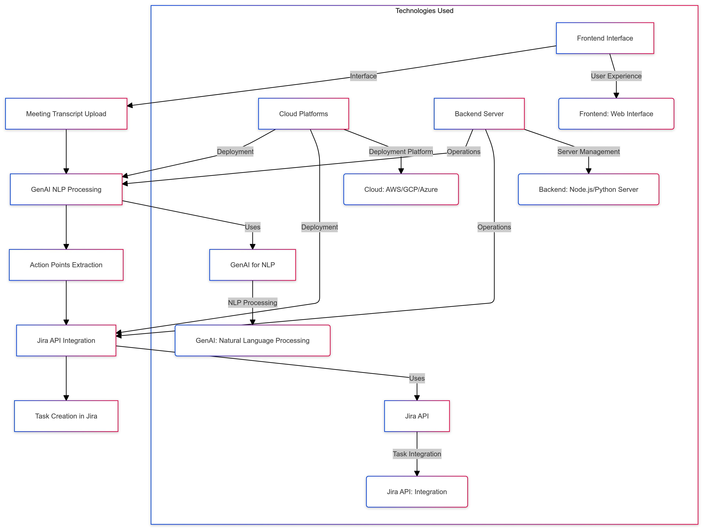

# Jira Automation

AI-Powered Meeting Summarization and Action Points Generator with Jira Integration.

This project converts meeting audio into AI-generated stories and lets users push selected stories into Jira.

## Architecture Diagram



## 1. Project Goal

At a high level:

- User authenticates in the React app.
- User validates Jira credentials.
- User uploads an MP3 for a selected Jira project.
- Audio is uploaded to S3 and async processing begins through SQS.
- Transcription service creates transcript text and forwards it to the story queue.
- OpenAI service generates structured user stories and stores them in MongoDB.
- Frontend polls for completion, displays stories, allows edit, and pushes chosen stories to Jira.

---

## 2. Repository Components

- `audio-jira`  
  React frontend for auth, Jira setup, project selection, upload, viewing/editing/pushing stories.

- `backend_service`  
  Node + Express + TypeScript API for user auth, user profile data, Jira token validation orchestration, and MP3 upload to S3.

- `sendMessagesToQueue_lambda_function`  
  AWS Lambda triggered by S3 object creation. Sends upload metadata to transcription queue.

- `transcription_service`  
  Node + TypeScript worker-like service that consumes transcription queue, calls Deepgram, writes transcript to S3, and sends message to story queue.

- `OpenAI-service`  
  Node + Express API + queue consumer. Generates stories from transcript text via OpenAI and stores in MongoDB. Also provides APIs for story CRUD and Jira push.

- `jira_service`  
  Python Flask service that validates Jira credentials and performs Jira API operations (create issue, fetch projects/issues/team members).

- `temporal_service`  
  Temporal API + worker service to orchestrate workflow state for upload-to-story-generation.

- `images`  
  Assets folder, including architecture diagram.

---

## 3. Main Data Stores and Queues

- MongoDB
    - `users` (from `backend_service` and also updated by `jira_service`)
    - `stories` (from `OpenAI-service`)
    - `user_projects` (from `OpenAI-service`)

- AWS S3
    - `audios/...` uploaded MP3 files
    - `transcriptions/...` generated transcript text files

- AWS SQS
    - `transcription_queue` (fed by S3/Lambda)
    - `story_queue` (fed by transcription service)

---

## 4. Service Internals

### 4.1 `audio-jira` (Frontend)

Primary pages/components:

- `src/pages/AuthPage.jsx`: signup/login and Google OAuth redirect.
- `src/pages/Dashboard.jsx`: project list, Jira modal, audio upload, polling for generated stories.
- `src/pages/TasksPage.jsx`: view generated stories, edit story, push to Jira.
- `src/components/JiraIntegrationModal.jsx`: validates Jira domain/email/token using `jira_service`.
- `src/components/TaskEditModal.jsx`: updates story in `OpenAI-service`.

Important behavior:

- Stores `jwt`, `username`, user IDs, and `validated` state in `localStorage`.
- Also reads `jwt` and `user_obj` cookies set by `backend_service`.
- Upload endpoint used: `POST http://localhost:8000/api/upload` with `Authorization: Bearer <jwt>`.
- Poll endpoint used: `GET http://localhost:3000/api/getActiveStories?user_id=...&project_id=...`.
- Fetch stories endpoint: `GET http://localhost:3000/api/stories/:project_id`.

### 4.2 `backend_service`

Entry: `src/index.ts`

- Loads env via `envLoader`.
- Connects MongoDB.
- Configures CORS for frontend origins.
- Mounts:
    - `app.use("/api/users", UserRoutes)`
    - `app.use("/api/upload", UploadRoutes)`

User/auth routes (`src/users/user.controller.ts`):

- `POST /api/users/signup`
- `POST /api/users/login`
- `GET /api/users/auth/google`
- `GET /api/users/auth/google/callback`
- `POST /api/users/validate_user` (JWT protected)  
  Calls Jira validation service and stores `username`, `api_token`, `domain` in user doc if valid.

Upload route (`src/upload/upload.ts`):

- Validates file extension is `.mp3`.
- Requires JWT user and `project_id`.
- Uploads to S3 with key pattern:
    - `audios/{userId}_{projectId}_{timestamp}_{originalFileName}`
- Calls `POST /api/user-projects` on `OpenAI-service` with API key to ensure `user_projects` record exists.
- Starts Temporal workflow through `temporal_service` (if configured).

Security/auth details:

- JWT via `passport-jwt`, token expected in `Authorization: Bearer`.
- Google OAuth via `passport-google-oauth20`.
- Sets `jwt` and `user_obj` cookies (`httpOnly: false`, `sameSite: lax`).

### 4.3 `sendMessagesToQueue_lambda_function`

Entry: `index.js` handler:

- Trigger: S3 object-created event.
- Extracts:
    - `user_id` from uploaded filename segment 1
    - `project_id` from uploaded filename segment 2
    - S3 URL from bucket/key
- Sends message to transcription queue:

```json
{
	"user_id": "...",
	"project_id": "...",
	"url": "https://<bucket>.s3.us-west-1.amazonaws.com/<key>"
}
```

### 4.4 `transcription_service`

Entry: `src/index.ts`

- Connects MongoDB.
- Starts infinite-loop SQS consumer on `TRANSCRIPTION_QUEUE_URL`.

Consumer (`src/sqs-consumer/sqs-consumer.service.ts`):

- Polls `receiveMessage` in a `while (true)` loop.
- For each message: parse JSON, process, then delete from queue.

Transcription processing (`src/transcription/transcription.service.ts`):

- Calls Deepgram (`nova-2`) with diarization/formatting flags.
- Extracts transcript text.
- Writes temp `.txt` locally, uploads to S3 under `transcriptions/`.
- Sends next message to story queue via producer:

```json
{
	"user_id": "...",
	"project_id": "...",
	"url": "<original audio url>",
	"file_url": "<transcription txt s3 url>",
	"status": "TRANSCIPTION_DONE",
	"timestamp": "<iso>"
}
```

### 4.5 `OpenAI-service`

Entry: `index.js`

- Connects MongoDB.
- Starts Express API routes under `/api`.
- Starts queue listener `listenForMessages()`.

Queue consumer (`SQSConsumer.js`):

- Polls `story_queue`.
- Reads `file_url` from each message.
- Downloads transcript text from S3 and processes via `processS3File`.
- Deletes message after processing.

OpenAI processing (`openAIClient.js`):

- Loads transcript text stream from S3.
- Creates prompt to generate JSON user stories.
- Uses model `gpt-4-turbo-preview`.
- Parses JSON, adds `story_id` UUID and `project_id`.
- Stores stories in `stories` collection.
- Updates `user_projects.active_stories = stories.length`.

API routes (`routes/storyPoints.js`):

- `GET /api/getActiveStories?user_id=...&project_id=...`
- `GET /api/stories/:project_id` (fetch generated stories)
- `PUT /api/stories/:story_id/:project_id` (edit story fields)
- `POST /api/user-projects` (requires `x-api-key`)
- `POST /api/pushToJIRA` (finds story, calls Jira service create endpoint, decrements `active_stories`)

Mongo models:

- `database/storySchema.js` -> `stories`
- `database/userProjects.js` -> `user_projects`

### 4.6 `jira_service`

Entry: `app.py` (Flask + CORS + Mongo)

Core purpose:

- Validate Jira credentials and store validation state.
- Proxy Jira operations using each user’s stored Jira creds.

Endpoints:

- `POST /validate_user`  
  Tests Jira `/rest/api/3/myself`, then upserts user config in Mongo `users`.
- `POST /create_jira_story?username=<email>`
- `GET /get_all_project_keys?username=<email>`
- `GET /get_all_issues_in_project?username=<email>&project_key=<key>`
- `GET /get_team_members?username=<email>&project_key=<key>`
- `GET /get_story_count_in_project?username=<email>&project_key=<key>`

Credential source:

- Pulls `username`, `domain`, `api_token` from Mongo `users` collection for the provided username.

### 4.7 `temporal_service`

Files:

- `src/index.js`: API endpoints to start workflow and check status.
- `src/worker.js`: worker process for task queue.
- `src/workflows.js`: workflow definition (`audioProcessingWorkflow`).
- `src/activities.js`: checks story generation completion via `OpenAI-service`.

Behavior:

- Workflow starts per upload (`user_id`, `project_id`).
- Periodically checks `/api/getActiveStories`.
- Completes when active stories are available, or returns timeout after max checks.

---

## 5. End-to-End Workflows

## Workflow A: User Signup/Login

1. User submits form in `AuthPage`.
2. Frontend calls:
    - `POST /api/users/signup` or
    - `POST /api/users/login` on `backend_service`.
3. `backend_service` creates/fetches user, validates password if login.
4. JWT generated and returned; `jwt` + `user_obj` cookies set.
5. Frontend stores key fields in `localStorage` and navigates to dashboard.

Google OAuth variant:

- Frontend redirects to `/api/users/auth/google`.
- Backend Google callback sets same cookies and redirects to dashboard URL.

## Workflow B: Jira Integration Validation

1. `JiraIntegrationModal` collects Jira URL, email, API token.
2. Frontend calls `POST /validate_user` on `jira_service`.
3. `jira_service` validates credentials via Jira `/myself`.
4. On success, service stores/updates user’s Jira config in Mongo `users`.
5. Frontend marks `validated=true`.

Note: `backend_service` also has `/api/users/validate_user` that calls Jira service and updates its user record; current UI modal calls Jira service directly.

## Workflow C: Audio Upload -> Story Generation (Async Pipeline)

1. User picks project and uploads MP3 in dashboard.
2. Frontend `POST /api/upload` to `backend_service` with JWT + `project_id`.
3. `backend_service`:
    - Validates JWT and mp3 extension.
    - Uploads file to S3 `audios/...`.
    - Calls `OpenAI-service /api/user-projects` to ensure mapping record exists.
    - Starts Temporal workflow (if `TEMPORAL_SERVICE_BASE_URL` configured).
4. S3 event triggers Lambda.
5. Lambda sends metadata (`user_id`, `project_id`, `url`) to `transcription_queue`.
6. `transcription_service` consumes message:
    - Calls Deepgram on audio URL.
    - Stores transcript txt in S3 `transcriptions/...`.
    - Sends `file_url` payload to `story_queue`.
7. `OpenAI-service` consumes story queue message:
    - Reads transcript txt from S3.
    - Calls OpenAI to generate stories.
    - Stores in Mongo `stories`.
    - Updates `user_projects.active_stories`.
8. Frontend polls `/api/getActiveStories`; when count > 0, it fetches `/api/stories/:project_id` and routes user to Tasks page.
9. Temporal workflow also detects completion and marks the orchestration as complete.

## Workflow D: Edit Story Before Jira Push

1. On Tasks page, user edits story in modal.
2. Frontend calls `PUT /api/stories/:story_id/:project_id`.
3. `OpenAI-service` updates Mongo story document and returns latest stories.

## Workflow E: Push Generated Story to Jira

1. User clicks “Create in Jira” for a story.
2. Frontend calls `POST /api/pushToJIRA` with `story_id`, `project_id`, `userId`.
3. `OpenAI-service`:
    - Loads story from Mongo.
    - Calls `jira_service /create_jira_story?username=<userId>`.
4. `jira_service`:
    - Fetches stored Jira creds for that username.
    - Creates issue via Jira REST API `/rest/api/3/issue`.
5. On success, `OpenAI-service` decrements `active_stories` in `user_projects` and returns Jira response.

## Workflow F: View Existing Jira Projects and Issues

From dashboard project selection/task view:

- Frontend calls:
    - `/get_all_project_keys` to list projects and counts.
    - `/get_all_issues_in_project` to list issues for selected project.
- Both are served by `jira_service`, which queries Jira on behalf of the user.

---

## 6. External Integrations

- Jira Cloud REST API (issues, projects, users, validation).
- OpenAI Chat Completions API for story generation.
- Deepgram API for transcription.
- AWS: S3 (storage), SQS (pipeline), Lambda (event fan-out).
- Temporal OSS (workflow orchestration and state tracking).

---

## 7. Environment and Runtime Notes

- Service URLs are present in frontend/backend routes; centralize with env vars for cleaner multi-environment deploys.
- Queue consumers (`transcription_service`, `OpenAI-service`) are infinite loops and should be run as managed workers (PM2/systemd/container).
- Current architecture is event-driven but mostly at-least-once; idempotency and retry policy control are partly implicit.
- Temporal service adds workflow state and failure visibility on top of existing queue-driven processing.

---

## 8. Potential Gaps / Risks (Current State)

- Inconsistent auth handling between cookies/localStorage and direct service calls.
- Some route/proxy leftovers in frontend (`src/services/api.js`) do not match active URLs.
- Sensitive credentials handling appears in multiple places; ensure secrets are only in env stores and TLS-protected transit.
- `pushToJIRA` decrements `active_stories` by project only (not explicitly by user+project), which may be problematic for multi-user same-project scenarios.
- Error paths in async consumers mostly log and continue; dead-letter queue behavior is not fully codified.

---

## 9. Request/Message Contracts (Quick Reference)

- Upload API (`backend_service`):
    - Multipart fields: `audio_file`, `project_id`
    - Header: `Authorization: Bearer <jwt>`

- Lambda -> transcription queue:

```json
{ "user_id": "...", "project_id": "...", "url": "..." }
```

- Transcription -> story queue:

```json
{
	"user_id": "...",
	"project_id": "...",
	"url": "...",
	"file_url": "...",
	"status": "TRANSCIPTION_DONE",
	"timestamp": "..."
}
```

- Push to Jira (`OpenAI-service`):

```json
{ "story_id": "...", "project_id": "...", "userId": "<email>" }
```

---

## 10. Operational Sequence (One-line)

`Frontend -> backend_service (upload) -> S3 -> Lambda -> transcription_queue -> transcription_service (Deepgram + transcript S3) -> story_queue -> OpenAI-service (generate + DB) -> Frontend fetch stories -> OpenAI-service pushToJIRA -> jira_service -> Jira Cloud`
